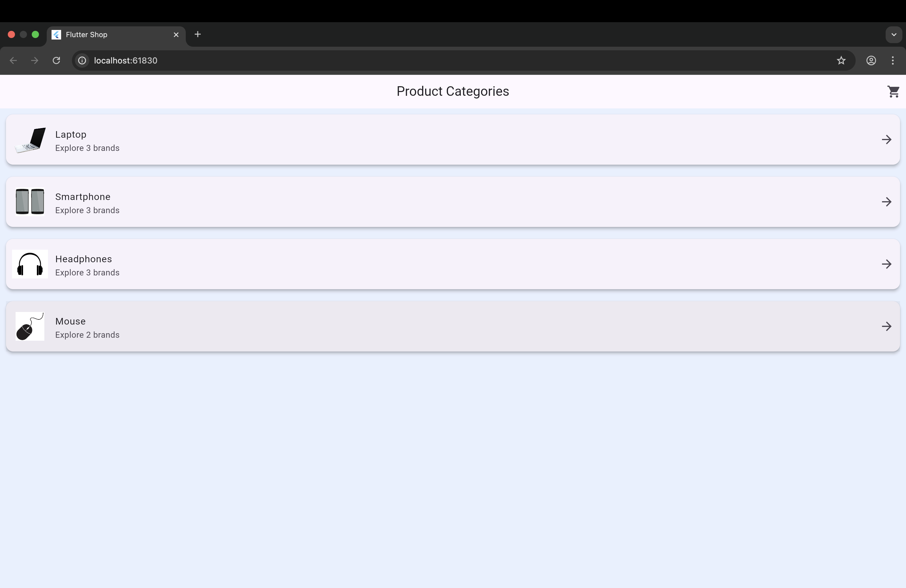

# 🛍️ Flutter Mobile Shop

A fully functional shopping application built with Flutter and Dart, demonstrating category-based product selection, variant configuration, dynamic cart updates, and a checkout flow. This application was developed as part of the COMP5450 Mobile Programming course.

---

## 🚀 Features

- Splash screen with branding
- Category-driven home screen
- Product variant, color, and quantity selection
- Add-to-cart per brand or all at once
- Real-time cart badge on home screen
- Item removal and full cart clearing
- Pay Now + success confirmation screen
- Light themed UI consistent with splash screen

---

## 📁 Project Structure

```
lib/
├── main.dart
├── models/
│   ├── item.dart
│   └── cart_item.dart
├── screens/
│   ├── splash_screen.dart
│   ├── home_screen.dart
│   ├── product_detail_screen.dart
│   ├── cart_screen.dart
│   └── purchase_success_screen.dart
└── assets/
    ├── categories/
    └── logos/
```

---

## 📸 Screenshots

### 🔹 Splash Screen
- **Android**  
  
- **iOS**  
  
- **Web**  
  
- **Real Device**  
  

### 🔹 Home Screen
- **Android**  
  
- **iOS**  
  
- **Web**  
  
- **Real Device**  
  

### 🔹 Product Detail Screen
- **Android**  
  
- **iOS**  
  
- **Web**  
  
- **Real Device**  
  

### 🔹 Cart Screen
- **Android**  
  
- **iOS**  
  
- **Web**  
  
- **Real Device**  
  

### 🔹 Purchase Success Screen
- **Android**  
  
- **iOS**  
  
- **Web**  
  
- **Real Device**  
  

---

## 🧪 How to Run the App

### On Real Android Device:
1. Enable USB Debugging
2. Connect phone via USB
3. Run:

```bash
flutter devices
flutter run
```

### On Web:
```bash
flutter run -d chrome
```

---

## 🧭 Functional Overview by Screen

### Splash Screen
Displays branding and transitions to the home screen after a short delay.

### Home Screen
Lists product categories with icons. Tracks cart count in the top-right.

### Product Detail Screen
Generates cards for each brand. Allows variant, color, quantity selection, and 'Add to Cart'.
Also supports a bulk add with the app bar tick button.

### Cart Screen
Displays items with details and total. Allows removal, clearing, and 'Pay Now' action.

### Purchase Success Screen
Shows confirmation emoji, quote, and back-to-home navigation.

---

## 🧠 Code Overview by Screen

### Splash Screen
Uses StatefulWidget and a Timer for delayed navigation with pushReplacementNamed.

### Home Screen
Maintains cart state, renders category list, updates badge based on cart state.

### Product Detail Screen
Tracks selection per brand using maps. Supports per-card and bulk 'Add to Cart' logic.

### Cart Screen
Uses custom Card UI with Remove, Clear, and Pay buttons. Shared cart state updates the home badge.

### Purchase Success Screen
Displays a styled message with a thank-you quote and returns to home screen.

---

## 📦 Asset Structure (as confirmed)

- assets/dell.png
- assets/razer.png
- assets/sony.png
- assets/laptop.png
- assets/mouse.png
- assets/smartphone.png
- assets/headphones.png
- assets/logo.png

---

## 🧪 Running the App on Emulators and Real Devices

### 📱 Android Emulator
1. Open Android Studio
2. Go to Tools > Device Manager
3. Launch an emulator (e.g., Pixel 5 API 33)
4. In the terminal, run:

```bash
flutter devices
flutter run
```

If multiple devices are connected, specify the emulator ID:

```bash
flutter run -d emulator-5554
```

### 🍏 iOS Simulator (Mac Only)
1. Open Xcode
2. Navigate to Xcode > Settings > Platforms > iOS
3. Launch a simulator (e.g., iPhone 14)
4. In terminal, run:

```bash
flutter devices
flutter run
```

If Flutter doesn’t detect the simulator:
```bash
open -a Simulator
flutter run
```

### 🔌 Real Android Device (USB)
1. Enable Developer Options > USB Debugging on your phone
2. Plug in your phone via USB
3. Authorize the connection when prompted
4. In terminal, run:

```bash
flutter run -d <device_id>
```

---

## 🙌 Developer

**Name:** Urvil Harkhani  
**Student ID:** 1271198  
**Course:** COMP5450 Mobile Programming  
**Instructor:** Dr. Sabah Mohammed
